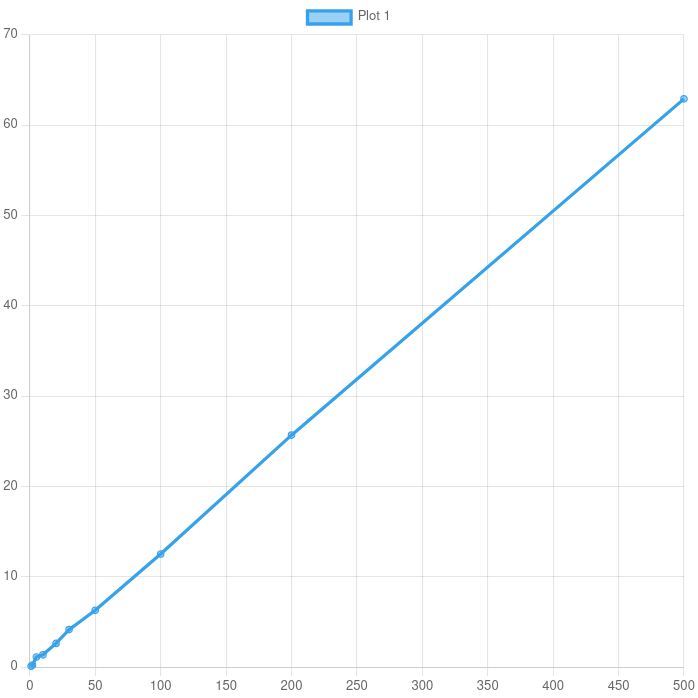

## Отчет по лабораторной работе №1
Дубняков Павел, Б22-544

### Задание
Вариант 6: Умножение матрицы на вектор

### Алгоритм выполнения бизнес-логики заключается в следующем:

- **Генерация данных:** На клиентской стороне создаются матрица и вектор случайных целых чисел. Размеры матрицы и вектора выбираются на основе указанного объема данных.

- **Вычисление контрольной суммы:** Для обеспечения целостности данных на клиенте вычисляется хеш (SHA-256) для отправляемых данных, включая элементы матрицы и вектора.

- **Передача данных на сервер:** Клиент по протоколу TCP отправляет матрицу, вектор и рассчитанный хеш на сервер. Данные отправляются в упакованном формате с использованием библиотеки `struct` для корректной передачи числовых данных.

- **Обработка данных на сервере:** На сервере данные распаковываются, и проверяется контрольная сумма для обеспечения их целостности. После этого сервер выполняет умножение матрицы на вектор.

- **Вычисление результата:** Сервер выполняет вычисление произведения матрицы на вектор, затем измеряет время, затраченное на выполнение данного вычисления.

- **Возвращение результата клиенту:** Сервер отправляет результат вычисления обратно клиенту вместе с временем выполнения вычислений и размером обработанных данных.

- **Проверка результата на клиенте:** Клиент получает результат от сервера, вычисляет аналогичное произведение локально и сравнивает его с результатом сервера для проверки правильности вычислений.

- **Сохранение данных:** Клиент сохраняет результат умножения и статистику (время выполнения и объем обработанных данных) в файлы для дальнейшего анализа.

### График зависимости времени выполнения от размера данных
По оси x - размер данных mb\
По оси y - время compute в ms

